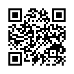
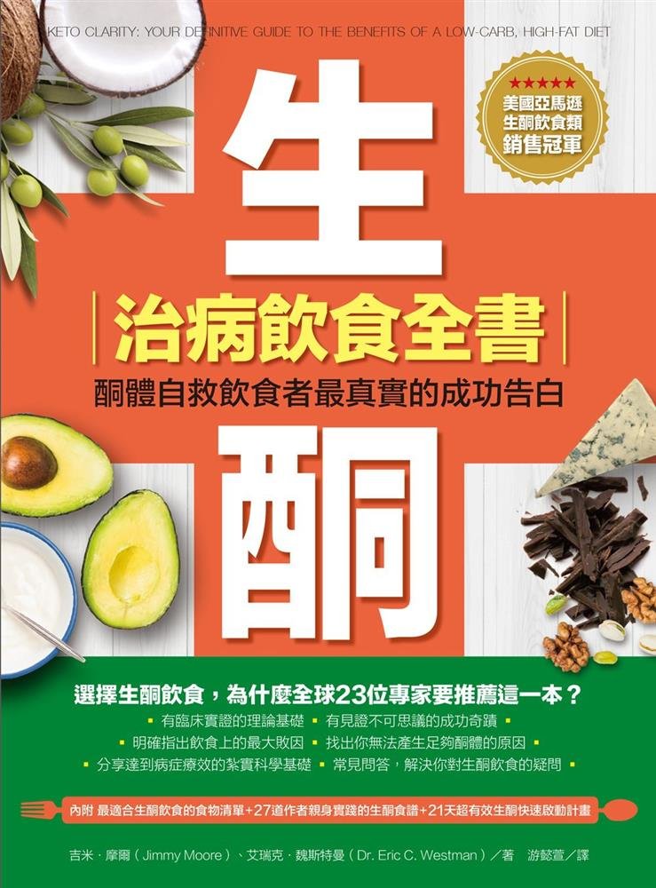

# 簡介

本文件為酮好社團台中讀書會第一屆的閱讀報告整理，書籍為「**生酮治病飲食全書：酮體自救飲食者最真實的成功告白**」。除了將書中的精華整理出來之外，並儘可能的加入更完整的參考資料，以及閱讀後的心得、感想及延伸想法等。

 **線上版本**  
 [https://goo.gl/BiR5vD](https://goo.gl/BiR5vD)  
 

## 生酮治病飲食全書：酮體自救飲食者最真實的成功告白

* 作者：
  * 吉米．摩爾 Jimmy Moore
  * 艾瑞克．魏斯特曼 Eric C. Westman
* 譯者：游懿萱
* 出版社：柿子文化
* 出版日期：2017/04/27
* ISBN：9789869431224

\(原著書名原文: Keto Clarity: Your Definitive Guide to the Benefits of a Low-Carb, High-Fat Diet\)

