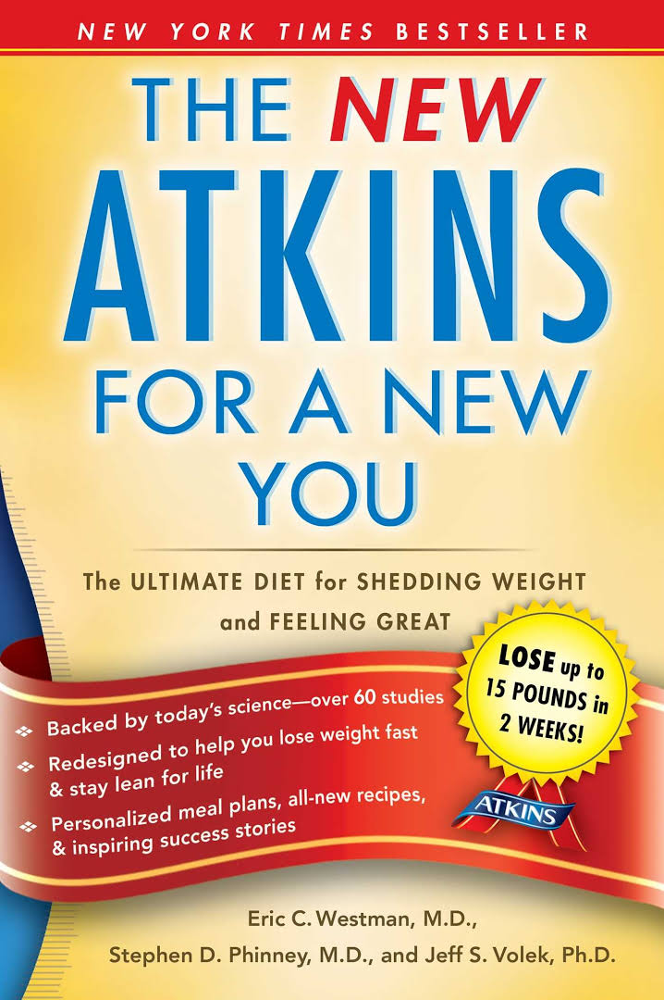
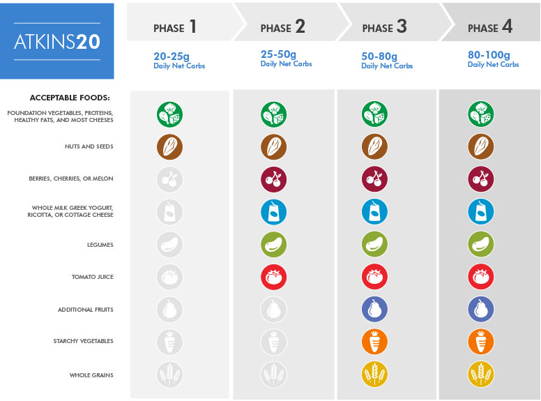
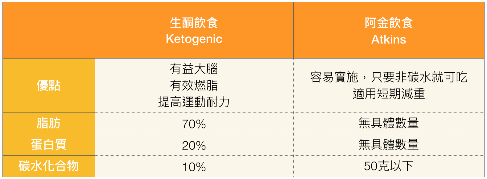
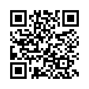

# 第二章 生酮飲食與阿金飲食不同之處

## What Makes Keto Different from the Atkins Diet?

不管是生酮飲食法，或是阿金飲食法，其本質上都是限制醣類的攝取來達到身體健康或是治療病症、減重等目的。透過歷史的檢視，便可發現人們很早就已經發現低醣飲食，可以為身體帶來極大的益處。也已發現碳水化合物可能帶來的危害。

## 低醣飲食的歷史

### 早期

1797 John Rollo 使用低醣飲食治療兩位患有糖尿病的軍官。

1863 [William Banting](https://en.wikipedia.org/wiki/William_Banting), 一位英國著名的殯葬業者，出版了一本 "_Letter on Corpulence Addressed to the Public_" 的小冊子，記載了他透過不吃麵包、奶油、牛奶、糖、啤酒及馬鈴薯，達成體重控制的方法。當時轟動社會，在當時這個字甚至成為了減肥的動詞，也一直沿用至今。

### 現代

1958 Richard Mackarness M.D. 出版了一本關於低醣飲食的著作 "_Eat Fat and Grow Slim"_，書中的建議與基礎與十年後的阿金Robert Atkins醫師發表的論點相同。

1967 Irwin Stillman出版了 "The Doctor's Quick Weight Loss Diet"。Stillman飲食法是一種高蛋白質、低醣、低脂的飲食法，可謂是美國首位成功推行低醣飲食廣為大眾所接受的先驅。其他在1960年代的低醣飲食法還有 Air Force 以及 drinking man's 飲食法等。

1972 Robert Atkins 發表了 Dr. Atkins Diet Revolution \(阿金醫師的減肥革命\)。由於其論點提及攝取大量脂肪與蛋白質，因此廣受當時的醫界批評。

1981 David Jenkins 發展出了升糖指數\(glycemic index\)，用以解釋不同種類碳水化合物的消化速度。

### 當代

1990 阿金醫師發表了新版的 Dr. Atkins New Diet Revolution \(阿金醫師的減肥大革命\)，當時許多醫生也以此為準則。自此美國開始掀起了「低碳熱潮」。

1900 ～ 2000早期，低碳飲食成為美國最受歡迎的飲食方法。食品製造商也開始注意到這一股影響到他們業務的飲食趨勢。部份主流醫學單位，也開始讉責低醣飲食可能危害健康。

## 低醣 vs. 生酮

生酮飲食是低醣飲食的一種，但其他的低醣飲食法，未必可以生酮。

除生酮飲食外，其他常被提及低醣飲食法如下：

* 阿金 Atkins
* 防彈 Bulletproof
* 原始人 Paleo

## 營養性酮化

「營養性酮化 \(Nutritional ketosis\)」這個詞彙在2010年，於 “The New Atkins for a New You” 此書中提出。

這本書的3位共同作者 Dr. Stephen D. Phinney; Dr. Jeff S. Volek 以及 Dr. Eric C. Westman，對『營養性酮化』作出定義：**採用高脂肪、適量蛋白質、低碳水化合物飲食讓身體改變**的概念。

## 阿金飲食法簡介

阿金飲食為採用低碳水化合物，高脂肪的飲食，對於蛋白質的攝取沒有具體的限制。

阿特金斯健康飲食法，又稱阿特金斯減肥法、阿金減肥法、低碳減肥法，也被稱作食肉減肥法、高蛋白減肥法，是美國醫生羅伯特·阿特金斯（Robert Atkins）創造的一種頗具爭議的減肥飲食方法，其要求完全不吃碳水化合物，而可以吃高蛋白的食品，即不吃任何澱粉類、高糖分的食品，而多吃肉類、魚。其核心是控制碳水化合物的攝入量，從而將人體從消耗碳水化合物的代謝轉化成以消耗脂肪為主的代謝模式。

因容易忽略了碳水化合物及蛋白質耐受度，造成醣質新生或是脫離酮症狀態。

阿金醫師在1970年代開始推廣酮症概念時，測量酮體數值的方式是由呼吸\(丙酮\)與尿液\(尿酮-乙醯乙酸\)。未增加酮體的具體方式。

阿金飲食缺點：

* 長期因反彈而有體重增加的可能
* 沒有品質或數量指南
* 沒有精神或身體上的性能好處

阿金飲食法演變至今，已分為兩個產品線，一個是阿金20，也就是傳統的阿金飲食法  
，將每日淨碳水化合物的攝取在20g以內。另一個是阿金40，將每日淨碳水化合物的攝取在40g以內，且不限制碳水化合物的食物來源。

[阿金飲食計劃官網](https://www.atkins.com/how-it-works/compare-plans)

## 生酮飲食與阿金飲食比較

在此引用阿金飲食官方網站阿金飲食與生酮飲食的比較圖，可看出兩種飲食法對食物來源比例的對照與比較

### 生酮飲食與阿金飲食的概略差異比較表

以下簡單整理出生酮飲食與阿金飲食的概略差異：

## 本章小結

本章主要說明了生酮飲食與阿金飲食的差異之處

最早推廣生酮飲食的人是已故的羅伯特．阿金醫師

低碳水化合物的阿金飲食與生酮飲食只有微妙的差異

生酮飲食並非一體適用於所有人身上，因為我們對碳水化合物的耐受程度因人而異。必需透過實踐，並在實踐的過程中，以科學的方法來監控與檢測，來找到適合自已的生酮公式。

將生酮飲食視為一種科學的飲食方式，如果在沒有測量酮體數值的狀況下，採用低碳水化合物、高脂肪的飲食，僅是一種猜測的遊戲而已。

## 補充資料

* [低碳水化合物飲食\(wikipedia 英文\)](https://en.wikipedia.org/wiki/Low-carbohydrate_diet)
* [低碳水化合物飲食\(wikipedia 中文\)](https://zh.wikipedia.org/wiki/低碳水化合物飲食)
* [THE KETOGENIC DIET VS THE ATKINS DIET: IS KETOSIS BETTER THAN ATKINS?](https://www.perfectketo.com/ketogenic-diet-vs-atkins-diet-ketosis-better-atkins/)
* [Atkins vs Keto: Here's the Truth About Keto and Atkins](https://kickincarbclutter.blogspot.tw/2017/08/atkins-vs-keto.html)
* [The Difference Between the Atkins and Ketogenic Diets](http://www.differencebetween.net/science/health/the-difference-between-the-atkins-and-ketogenic-diets/)
* [History of the ketogenic diet by James W. Wheless](http://onlinelibrary.wiley.com/doi/10.1002/%28SICI%291520-7560%28199911/12%2915:6<412::AID-DMRR72>3.0.CO;2-8/full)

 **本章節的線上版本**  
 [https://goo.gl/U2fJww](https://goo.gl/U2fJww)  
 

